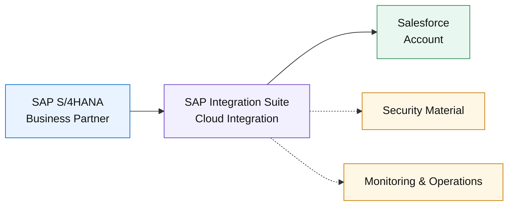
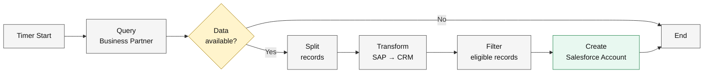
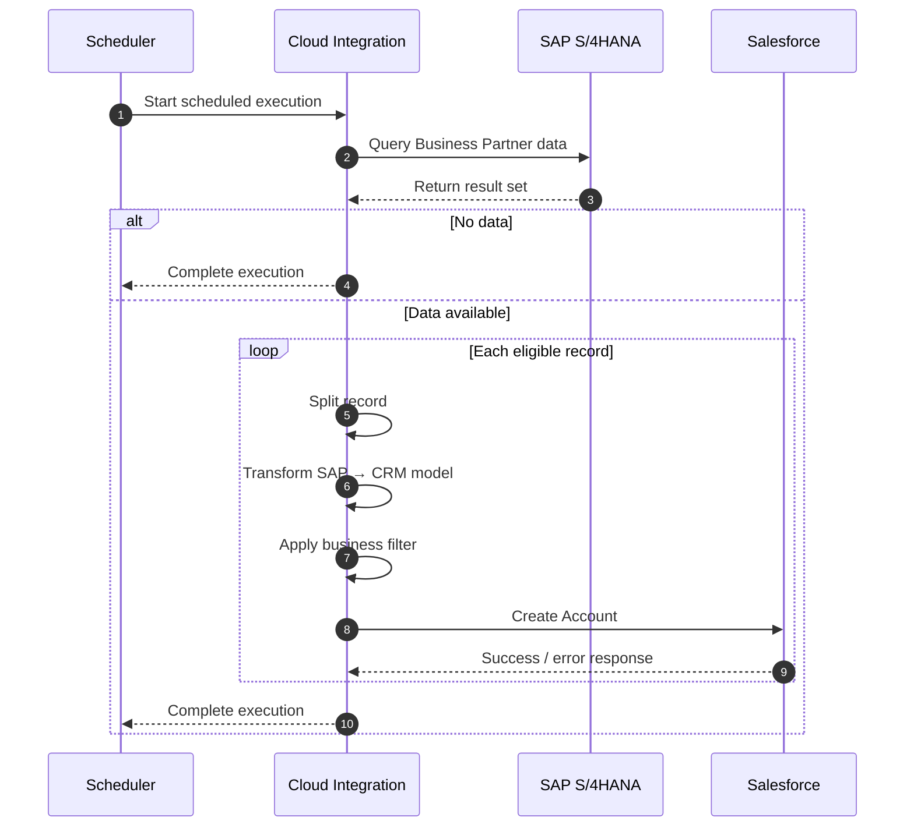
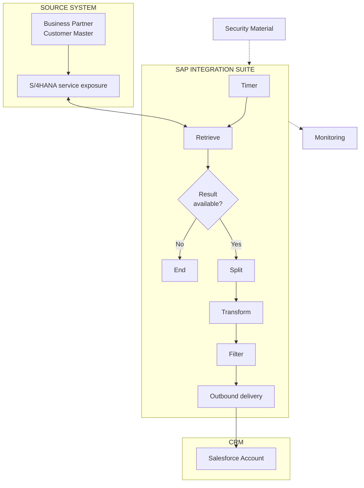
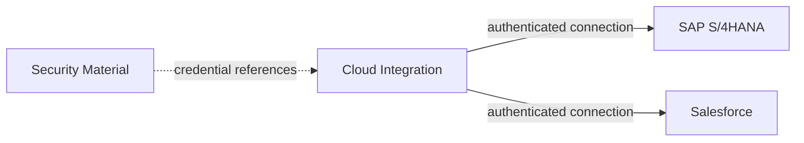
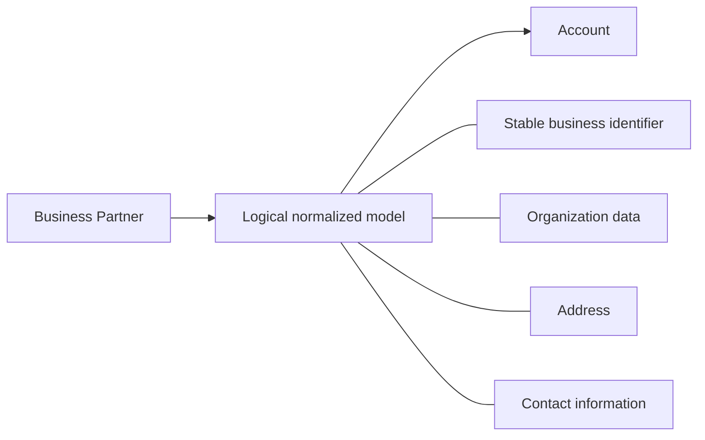
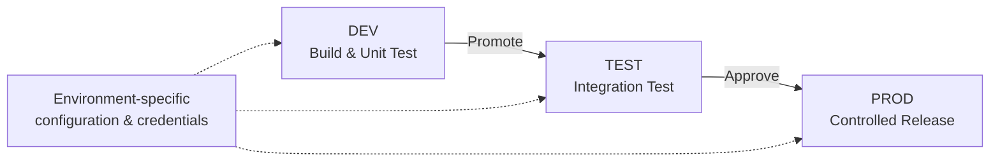
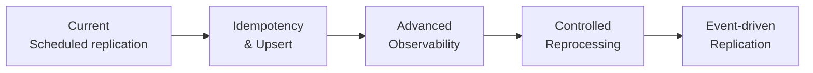

# Business Partner Synchronization

### SAP S/4HANA → SAP Integration Suite → Salesforce

> **Architecture portfolio case study**
>
> A production-oriented architecture design based on the SAP Discovery Center mission **“Synchronize Account Data Between SAP S/4HANA and Third-Party CRM”**.
>
> The mission provides the implemented integration scenario. This repository extends it into an **Integration Architect case study** covering requirements, architecture, integration patterns, security, API design, mapping, error handling, monitoring, deployment and future evolution.

<p align="center">
  
  
  
  
</p>

---

## 1. Executive Summary

The business maintains customer master information in **SAP S/4HANA**, while customer-facing processes also depend on **Salesforce Accounts**.

The integration establishes a controlled synchronization path:



### Business outcome

- Reduce manual replication of customer/account information.
- Keep CRM data aligned with SAP customer master data.
- Isolate SAP and CRM data-model differences in the integration layer.
- Centralize connectivity, transformation and operational monitoring.
- Establish a reusable pattern for future CRM integrations.

---

## 2. Architecture at a Glance

| Area | Decision |
|---|---|
| **Source of truth** | SAP S/4HANA Business Partner |
| **Integration platform** | SAP Integration Suite / Cloud Integration |
| **Target** | Salesforce Account |
| **Trigger** | Configurable recurring schedule |
| **Integration style** | Scheduled system-to-system replication |
| **Processing** | Query → evaluate → split → transform → filter → deliver |
| **Security** | Externalized credentials / Security Material |
| **Operations** | Cloud Integration monitoring |
| **Current scope** | SAP S/4HANA → Salesforce |
| **Future direction** | Stronger idempotency, recovery, observability and event-driven options |

---

## 3. End-to-End Integration Flow



### Processing sequence



---

## 4. Architecture Principles

### 01 — Mediation over point-to-point coupling

SAP S/4HANA and Salesforce remain independent applications. **SAP Integration Suite owns the integration boundary**, including orchestration, transformation and connectivity.

### 02 — Externalize security

Credentials are stored in **SAP Integration Suite Security Material** and referenced by the integration rather than embedded in flow logic.

### 03 — Separate business logic from connectivity

The integration flow handles the replication process while environment-specific endpoints, credentials and scheduling remain configurable.

### 04 — Design for observability

A production integration must make it possible to determine whether an execution ran, what failed, where it failed and whether recovery is possible.

### 05 — Avoid overclaiming

The repository distinguishes between:

> **Mission evidence** — demonstrated in the SAP Discovery Center exercise.

and

> **Portfolio design** — architecture decisions and production-oriented recommendations added to demonstrate Integration Architect thinking.

---

## 5. What Was Implemented vs. What Was Designed

| Capability | Status |
|---|:---:|
| SAP S/4HANA → Cloud Integration → Salesforce scenario | ✅ Mission |
| Scheduled execution | ✅ Mission |
| Business Partner query | ✅ Mission |
| Result evaluation | ✅ Mission |
| Record splitting | ✅ Mission |
| Transformation | ✅ Mission |
| Filtering | ✅ Mission |
| Salesforce Account creation | ✅ Mission |
| Security Material configuration | ✅ Mission |
| Deployment | ✅ Mission |
| Detailed business requirements | 🧭 Portfolio design |
| Production API contract | 🧭 Portfolio design |
| Field-level mapping specification | 🧭 Portfolio design |
| Error/retry/reprocessing strategy | 🧭 Portfolio design |
| Operational KPI model | 🧭 Portfolio design |
| Multi-environment deployment strategy | 🧭 Portfolio design |
| Idempotency / upsert strategy | 🧭 Portfolio design |
| Enterprise alerting model | 🧭 Portfolio design |
| Event-driven evolution | 🧭 Future design |

This distinction is intentional: the repository demonstrates **architecture capability without presenting a learning exercise as a production implementation**.

---

## 6. Key Architectural Decisions

### Decision 1 — Use SAP Integration Suite as the mediation layer

**Why:** SAP S/4HANA and Salesforce have different data models, connectivity mechanisms and authentication requirements.

**Result:** transformation, orchestration and connectivity are centralized in the integration platform.

→ [`ADR-001: Integration Mediation`](docs/adr-001-integration-mediation.md)

### Decision 2 — Keep credentials outside integration logic

**Why:** credentials should be managed independently from the integration artifact.

**Result:** Security Material is referenced by logical aliases/names.

→ [`Security`](docs/security.md)

### Decision 3 — Treat SAP S/4HANA as the source of truth

**Why:** this case is focused on replication of customer master information into CRM.

**Result:** Salesforce is treated as the consuming CRM representation.

→ [`Architecture`](docs/architecture.md)

---

## 7. Integration Architecture



### Responsibility boundaries

| Component | Primary responsibility |
|---|---|
| **SAP S/4HANA** | Own Business Partner/customer master information |
| **S/4HANA service exposure** | Provide source data to the integration |
| **Cloud Integration** | Schedule, retrieve, process, transform and deliver |
| **Security Material** | Store authentication material |
| **Salesforce** | Receive CRM Account representation |
| **Monitoring** | Provide operational visibility |

→ [`Solution Architecture`](docs/architecture.md)

---

## 8. Integration Pattern

**Pattern:** Scheduled mediated replication.

```text
Scheduler
   │
   ▼
Retrieve source data
   │
   ▼
Evaluate result
   │
   ├── No data ───────────────► End
   │
   ▼
Split records
   │
   ▼
Transform
   │
   ▼
Filter
   │
   ▼
Create target record
   │
   ▼
Monitor / recover
```

The pattern is deliberately simple for the current use case. More advanced patterns such as event-driven replication, asynchronous decoupling or bulk processing become relevant when business latency or volume requirements increase.

→ [`Integration Pattern`](docs/integration-pattern.md)

---

## 9. Security Model



Key controls:

- Credentials are not hard-coded.
- Security Material is managed outside the flow logic.
- Technical users should follow least-privilege principles.
- External communication should use TLS-protected HTTPS.
- Secrets and access tokens must never be committed to Git.
- Production monitoring should avoid unnecessary exposure of customer payloads.

→ [`Security`](docs/security.md)

---

## 10. API & Data Design

The mission establishes the integration scenario but does **not** provide a complete production API contract or field-level mapping.

Therefore, this repository documents the design at the **logical interface level** rather than inventing endpoint URLs or unsupported fields.



Design priorities:

1. Keep source and target contracts independent.
2. Use stable business identifiers.
3. Validate mandatory target attributes.
4. Define pagination and volume handling for production.
5. Prefer idempotent create/update semantics where required.
6. Keep exact field mappings under explicit interface ownership.

→ [`API Design`](docs/api-design.md)  
→ [`Mapping`](docs/mapping.md)

---

## 11. Error Handling & Recovery

The architecture distinguishes between:

| Error class | Example | Response |
|---|---|---|
| **Connectivity** | SAP/Salesforce unavailable | Retry according to policy |
| **Authentication** | Invalid/expired credentials | Fail fast + alert |
| **Validation** | Missing mandatory target data | Reject record + diagnostic |
| **Business rule** | Record excluded by filter | Do not send |
| **Target error** | Salesforce rejects request | Capture response + recovery |
| **Unexpected** | Runtime/processing error | Log + investigate |

### Recovery principle

> **Do not blindly retry every failure.**

Transient technical failures may be retried. Validation and business-data failures require correction rather than repeated delivery.

→ [`Error Handling`](docs/error-handling.md)

---

## 12. Monitoring & Operations

Operations should be able to answer:

```text
Did the job run?
      ↓
Did it succeed?
      ↓
How many records were processed?
      ↓
Which records failed?
      ↓
Why did they fail?
      ↓
Can they be safely reprocessed?
```

Recommended operational indicators:

- execution count;
- successful / failed executions;
- records read;
- records filtered;
- records delivered;
- records failed;
- processing duration;
- retry count;
- authentication/connectivity failures.

→ [`Monitoring`](docs/monitoring.md)

---

## 13. Deployment Strategy

The portfolio design separates the integration lifecycle from environment-specific configuration:



The exact CI/CD tooling is intentionally left open because it was not demonstrated by the mission.

→ [`Deployment Strategy`](docs/deployment-strategy.md)

---

## 14. Testing Strategy

Testing covers both the implemented integration flow and the production-oriented architecture.

### Functional

- Valid Business Partner
- Multiple records
- Empty source result
- Filtered record
- Missing mandatory target data
- Duplicate source identifier

### Technical

- SAP connectivity
- Salesforce connectivity
- Security Material references
- Authentication failure
- Temporary target failure
- Monitoring visibility

### Non-functional

- Large result sets
- Processing duration
- Retry behaviour
- Target throttling
- Recovery after temporary outage

→ [`Test Strategy`](docs/test-strategy.md)

---

## 15. Limitations & Future Evolution

### Current limitations

- Scheduled rather than event-driven replication.
- Mission does not establish a full production API contract.
- Exact field-level mapping is not available from the source material.
- Idempotency/upsert semantics require explicit business-key decisions.
- Production-grade retry and reprocessing behaviour requires further implementation.
- Enterprise alerting and SLA targets are outside the mission scope.

### Future evolution



The target evolution is not “add complexity for its own sake”. Each capability should be introduced when justified by business latency, volume, reliability or operational requirements.

→ [`Limitations & Future Improvements`](docs/limitations-future-improvements.md)

---

## 16. Repository Guide

| Document | What it answers |
|---|---|
| [`Business Requirements`](docs/business-requirements.md) | **Why** is the integration needed? |
| [`Architecture`](docs/architecture.md) | **What** is the solution structure? |
| [`Integration Pattern`](docs/integration-pattern.md) | **How** does the integration process data? |
| [`Security`](docs/security.md) | **How** are connectivity and credentials protected? |
| [`API Design`](docs/api-design.md) | **What** are the logical interfaces? |
| [`Mapping`](docs/mapping.md) | **How** is source data transformed? |
| [`Error Handling`](docs/error-handling.md) | **What happens when something fails?** |
| [`Monitoring`](docs/monitoring.md) | **How do operations know what happened?** |
| [`Deployment Strategy`](docs/deployment-strategy.md) | **How does the solution move between environments?** |
| [`Test Strategy`](docs/test-strategy.md) | **How is the solution validated?** |
| [`ADR-001`](docs/adr-001-integration-mediation.md) | **Why was the mediation approach chosen?** |
| [`Limitations & Future Improvements`](docs/limitations-future-improvements.md) | **What comes next?** |
| [`Mission Evidence`](docs/mission-evidence.md) | **What was actually demonstrated?** |

---

## 17. Source & Evidence

The case is based on the SAP Discovery Center mission **“Synchronize Account Data Between SAP S/4HANA and Third-Party CRM”** and the supplied mission screenshots.

The source material supports the following implementation facts:

- SAP S/4HANA is the source.
- SAP Integration Suite / Cloud Integration is the integration platform.
- Salesforce is the CRM example.
- Business Partner data is queried.
- The flow evaluates returned data.
- Records are split, transformed and filtered.
- Salesforce Account creation is performed.
- A recurring Timer Start is used.
- Security Material is configured.
- Salesforce OAuth2 Client Credentials are configured.
- S/4HANA and Salesforce receiver connectivity is configured.
- The integration is deployed.

The source does **not** establish complete production API contracts, field-level mapping, SLA/RPO/RTO, enterprise alerting, CI/CD or a complete production error/reprocessing architecture.

Those areas are therefore explicitly documented as **portfolio design**, not mission evidence. fileciteturn0file0

→ [`Mission Evidence vs Portfolio Design`](docs/mission-evidence.md)

---

<p align="center">
  <b>Business Requirements → Architecture → Integration Pattern → Security → API Design → Mapping → Error Handling → Monitoring → Deployment → Evolution</b>
</p>
