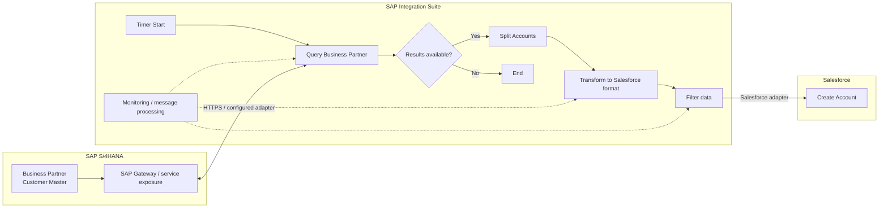

# Solution Architecture

## 1. Architecture overview

The solution uses SAP Integration Suite / SAP Cloud Integration as a mediation layer between SAP S/4HANA and Salesforce.

## 2. Component responsibilities

| Component | Responsibility |
|---|---|
| SAP S/4HANA | Owns Business Partner/customer master data |
| SAP Gateway / S/4HANA service | Exposes the source data to the integration |
| SAP Cloud Integration | Orchestrates scheduling, retrieval, validation, splitting, transformation, filtering and delivery |
| Security Material | Stores authentication material referenced by the integration |
| Salesforce | Receives the transformed Account records |
| Integration Monitoring | Provides operational visibility into executions and failures |

## 3. Logical sequence

1. Timer starts the flow.
2. Cloud Integration invokes the S/4HANA query.
3. S/4HANA returns Business Partner results.
4. Cloud Integration checks whether results are available.
5. The result set is split into account-level messages.
6. Each message is transformed to the Salesforce representation.
7. Business filtering is applied.
8. Salesforce receives the eligible Account.
9. The execution completes.

## 4. Architectural principles

### Mediation over point-to-point coupling

SAP and Salesforce should not be directly coupled at the application level. Cloud Integration owns protocol mediation, transformation and orchestration.

### Externalized credentials

Credentials belong to the integration platform's security material and are referenced by name.

### Configuration over hard-coding

Endpoints, schedules and credential aliases should be environment-specific configuration.

### Observable integration

The integration should produce enough operational evidence to identify failed executions and investigate message-level problems.

## 5. System of record

For this use case, SAP S/4HANA is treated as the source of truth for the replicated customer master information. Salesforce is the consuming CRM representation.

## 6. Architecture boundary

This case does not demonstrate a full enterprise integration platform architecture. It is a focused point-to-point mediated integration. In a larger landscape, the same pattern can be standardized through reusable integration content, canonical models, API governance and centralized monitoring.
