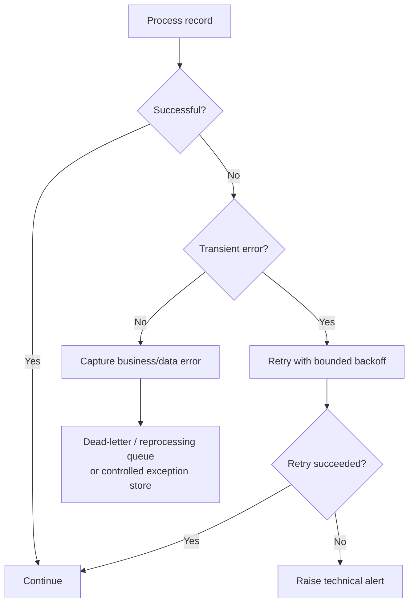

# Error Handling

## 1. Objective

Errors must be handled without hiding failed records or creating inconsistent CRM data.

The mission demonstrates a successful flow and monitoring configuration but does not provide a complete production error-handling subprocess. This document therefore defines the recommended portfolio-level strategy.

## 2. Error categories

| Category | Example | Recommended action |
|---|---|---|
| Connectivity | SAP unavailable | Retry with controlled backoff; alert after threshold |
| Authentication | Expired/invalid credential | Fail execution; alert integration support |
| Source data | Invalid/incomplete BP | Reject record; record business error |
| Transformation | Mapping/value conversion failure | Reject record; capture reason |
| Target validation | Salesforce mandatory field missing | Reject record; capture target response |
| Target throttling | Salesforce rate limit | Retry according to target policy |
| Target outage | Salesforce unavailable | Retry; then alert |
| Duplicate | Account already exists | Use idempotent upsert/duplicate strategy |

## 3. Error processing model

## 4. Retry strategy

**Portfolio design:** retries should be limited and should distinguish transient from permanent failures.

Example policy to be tuned for the target:
- 3 attempts;
- exponential backoff;
- no retry for validation/authentication errors unless the underlying cause is corrected;
- alert after exhausted retries.

These numbers are proposed design defaults, not mission facts.

## 5. Idempotency

A retry must not create duplicate Accounts.

Recommended production strategy:
- carry the SAP Business Partner identifier as a stable external key;
- query or upsert against that key;
- treat duplicate detection as a business/technical rule rather than relying on manual cleanup.

## 6. Reprocessing

Failed records should be recoverable without rerunning the entire source population where possible.

A production implementation should provide:
- failed record identifier;
- timestamp;
- error category;
- target response;
- correlation/message ID;
- reprocessing status.

## 7. Error ownership

| Error | Owner |
|---|---|
| SAP connectivity | Integration / SAP platform |
| SAP source data | SAP functional/business owner |
| Mapping | Integration team |
| Salesforce authentication/API | CRM/integration team |
| Business eligibility | Business owner |
