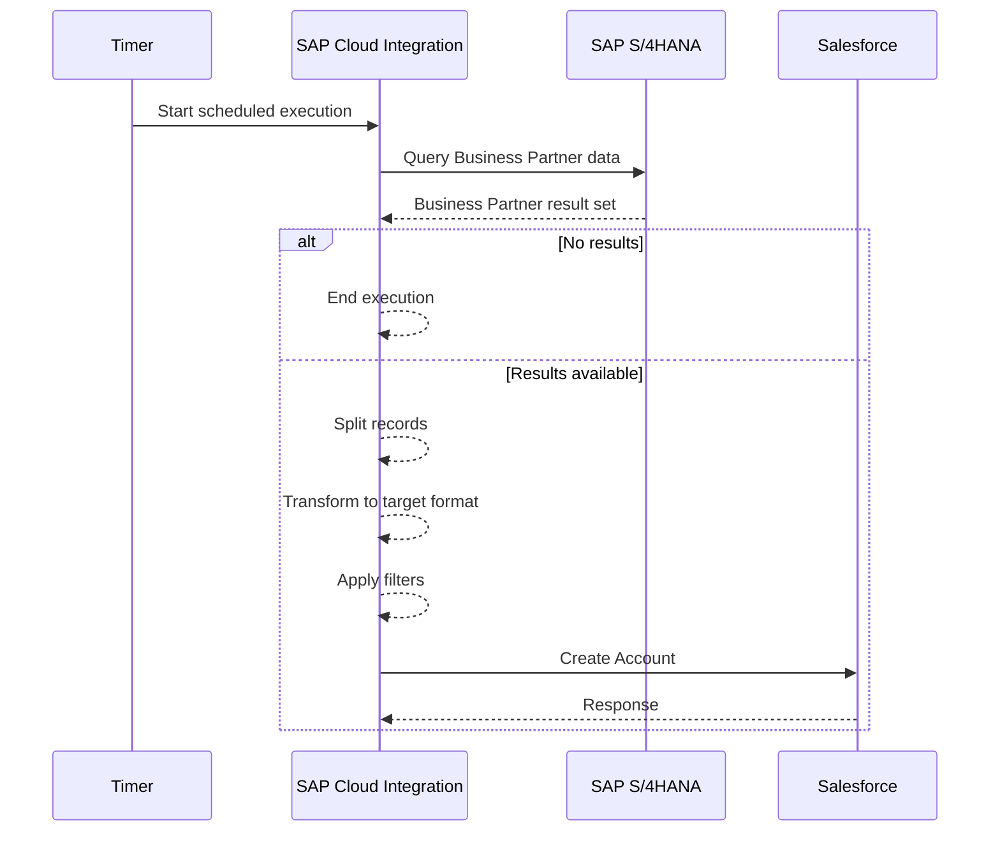

# Integration Pattern

## Pattern: Scheduled Request-Reply / Polling with Mediation

The mission implements a scheduled integration in which Cloud Integration periodically initiates a query to SAP S/4HANA, receives Business Partner results, transforms them and sends eligible records to Salesforce.

### Pattern characteristics

- **Trigger:** Timer / scheduled execution
- **Source interaction:** Request/query against SAP S/4HANA
- **Processing:** Validate → split → transform → filter
- **Target interaction:** Salesforce Account creation
- **Direction:** SAP S/4HANA → Salesforce
- **Runtime:** SAP Cloud Integration

## Why this pattern fits the use case

The source scenario is master-data replication rather than an interactive user transaction. A scheduled polling model is therefore appropriate when near-real-time propagation is not a business requirement.

It also keeps the source and target systems independent: SAP does not need to know the Salesforce implementation details, and Salesforce does not directly query SAP.

## Processing model

## Important design choice: split before transformation

The mission flow explicitly separates the result set into individual accounts before transforming the data. This makes record-level processing and diagnostics easier.

## Scheduling

The mission configures the Timer Start using **Schedule to Recur**, with a configurable recurrence and time zone.

For production, the actual interval should be derived from the business freshness requirement rather than selected arbitrarily.

## When this pattern should be replaced

Use event-driven integration when:
- CRM must reflect changes within seconds/minutes;
- source events are reliably available;
- polling creates unacceptable source-system load.

Use batch-oriented processing when:
- very large volumes must be processed;
- a controlled processing window is more important than low latency.

## Idempotency consideration

**Portfolio design:** the source material demonstrates Account creation but does not specify an idempotency strategy. A production solution should define a stable source key and target lookup/upsert strategy to prevent duplicate CRM Accounts on retries.
