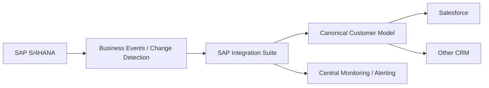

# Limitations and Future Improvements

## 1. Current limitations

### 1.1 Scheduled polling

The current scenario is timer-driven. Changes are not propagated immediately.

**Improvement:** evaluate event-driven integration using supported SAP business events when near-real-time synchronization becomes a requirement.

### 1.2 Create-oriented target flow

The mission describes creation of Salesforce Accounts. It does not establish a full lifecycle synchronization strategy.

**Improvement:** implement idempotent upsert and define update/delete/deactivation semantics.

### 1.3 Field-level mapping is not documented

The mission material supplied for this portfolio does not provide the exact source-to-target field mapping.

**Improvement:** create an approved mapping specification with source field, target field, transformation, mandatory/optional status and code conversion.

### 1.4 Error handling is not fully demonstrated

The mission demonstrates deployment and monitoring configuration but does not document a production-grade retry/dead-letter/reprocessing architecture.

**Improvement:** add bounded retries, centralized exception handling, dead-letter/reprocessing and alerting.

### 1.5 Large-volume behavior

The supplied mission does not specify volume, pagination, batching or performance limits.

**Improvement:** perform volume testing and define pagination, batch size, parallelism and source-load constraints.

### 1.6 Duplicate prevention

The source material does not define a stable target idempotency key.

**Improvement:** use the SAP Business Partner identifier as a controlled external key where appropriate and implement upsert semantics.

### 1.7 Single target

The case focuses on Salesforce.

**Improvement:** generalize the integration design into reusable patterns for additional CRM platforms.

## 2. Future architecture evolution

## 3. Prioritized roadmap

| Priority | Improvement | Value |
|---|---|---|
| P1 | Define field-level mapping | Functional correctness |
| P1 | Define idempotency/upsert strategy | Prevent duplicates |
| P1 | Production error/reprocessing model | Operability |
| P2 | Volume/performance testing | Scalability |
| P2 | Automated deployment | Delivery reliability |
| P2 | Centralized alerting | Faster incident response |
| P3 | Event-driven synchronization | Lower latency |
| P3 | Canonical model / reusable integration assets | Reuse |

## 4. Architectural maturity

The mission implementation is a good **Level 1 portfolio case**: mediated system-to-system integration with scheduling, transformation, filtering, security configuration and deployment.

A production-grade enterprise implementation would add stronger governance around APIs, lifecycle management, idempotency, observability, testing, CI/CD and master-data ownership.
