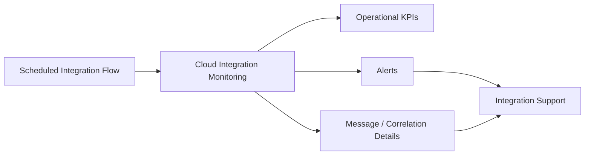

# Monitoring and Operations

## 1. Monitoring objective

Operations must be able to answer four questions quickly:

1. Did the scheduled execution run?
2. Did it complete successfully?
3. Which records failed?
4. Why did they fail and can they be reprocessed?

## 2. Mission evidence

The mission configures logging-related options in the integration flow and uses SAP Cloud Integration monitoring as the operational environment.

The screenshots show configuration options including exception logging and message-log-related settings.

## 3. Recommended monitoring model

## 4. Operational KPIs

**Portfolio design:**

| KPI | Purpose |
|---|---|
| Executions started | Confirms scheduler activity |
| Successful executions | Availability indicator |
| Failed executions | Reliability indicator |
| Records read | Source volume |
| Records filtered | Business-rule visibility |
| Records sent | Target volume |
| Records failed | Data/technical quality |
| Processing duration | Performance trend |
| Retry count | Target/source stability |

## 5. Correlation

Every execution should have a correlation identifier that can be followed across:
- timer execution;
- source query;
- transformation;
- target request;
- error record.

## 6. Alerting

Alert on:
- repeated execution failures;
- authentication failures;
- source/target connectivity failures;
- unusual volume deviations;
- repeated business-data validation failures;
- excessive processing duration.

Avoid alerting on every individual transient error if the platform can aggregate and alert after a threshold.

## 7. Logging policy

Production logs should contain enough information for diagnosis but should not expose:
- client secrets;
- access tokens;
- unnecessary full customer payloads;
- other sensitive information.

## 8. Operational runbook

### Failed execution

1. Identify the failed execution and correlation ID.
2. Determine whether the error is technical or business/data-related.
3. Check source/target availability and credentials.
4. Inspect the failed record and mapping stage.
5. Correct the underlying issue.
6. Reprocess only the affected records where supported.
7. Confirm successful delivery to Salesforce.
