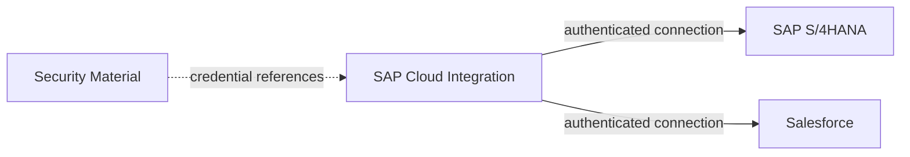

# Security

## 1. Security objectives

The integration must protect:
- authentication credentials;
- SAP and Salesforce connectivity;
- customer master data in transit;
- access to integration artifacts and monitoring information.

## 2. Mission evidence

The mission includes a step to create the required security materials in SAP Integration Suite.

For Salesforce, the documented setup creates **OAuth2 Client Credentials** security material containing:
- a security material name;
- Token Service URL;
- Client ID;
- Client Secret.

The integration flow also references:
- an S/4HANA credential name;
- a Salesforce Basic Credential;
- a Salesforce Security Token Alias;
- a Salesforce OAuth Credential Name.

## 3. Security architecture

## 4. Credential management

### Required controls

- Never hard-code secrets in an integration flow.
- Use SAP Integration Suite Security Material.
- Reference credentials by logical alias/name.
- Restrict security-material administration to authorized integration administrators.
- Rotate credentials according to enterprise policy.
- Avoid placing secrets in screenshots, Git repositories or README files.

## 5. Transport security

**Portfolio design:** use TLS-protected HTTPS connections for external communication. Certificate validation should remain enabled according to enterprise security policy.

The exact TLS configuration, certificates and network controls are environment-specific and are not specified by the mission.

## 6. Least privilege

The technical users used for the integration should receive only the permissions required to:
- read the relevant Business Partner data from S/4HANA;
- create/update the required Account representation in Salesforce;
- access only the necessary integration runtime resources.

## 7. Sensitive data in monitoring

Customer master information may be business-sensitive. Production monitoring should therefore avoid logging full payloads unless required for support and permitted by data-protection policy.

## 8. Security checklist

- [ ] Credentials externalized to Security Material
- [ ] No secrets committed to Git
- [ ] Technical users use least privilege
- [ ] HTTPS/TLS enforced
- [ ] Credential rotation process defined
- [ ] Monitoring data classified
- [ ] Production support access restricted
